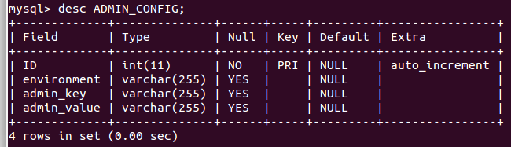

# mediaserver-module
Mediaserver core module

.png)

# Background & Purpose
The Mediaserver (aka. 'attachment server')  handles media files and their metadata.

The functionality is implemented using the RESTful-architecture style 

1. The Mediaserver can be used as a standalone server (no coupling to an external system).
2. The Mediaserver can be used as an integrated part of the collections management system (coupled).

The Mediaservers has the basic CRUD responsibilities:

1. Storing : Storing binaries to the filesystem and Storing the metadata to a database.
2. Retrieving: Retrieving the binaries and retrieving the metadata for the binaries.
3. Update: Updating the binaries and updating the metadata for the binaries.
4. Delete: Deleting the binaries and updating the metadata for the binaries.

## Constraints
1. The Mediaserver stores the binary-files to the local file system, to the file system where the Mediaserver is installed.

# Functional Requirements

The Mediaserver should provide services for other systems.

1. To store media files (Create)
2. To edit media files (Update)
3. To search on metadata, fetch mediafiles (Retrieve) 
4. To delete media files (Delete)

## Storing the media files 
The mediafiles are stored in the filesystem, which has a depth of 3 levels.
Only one mediafile is stored, no derivates for images are created at the same time. 

All medifiles are stored using UUID as names. 

UUID, " Universally unique identifier, 128-bit number." ( http://tools.ietf.org/html/rfc4122) 

### directory-structure
The directories range from '0' to 'F' (hexadecimal) with a depth of 3 layers, which results in 4096 directories ( 16^3 ). 
To illustrate, 10 000 000 (ten million) mediafiles would be, with an even spread, would be divided into 2441 mediafiles per directory. 

All media files are processed in the same way - they are streamed to the filesystem and streamed back to their client.

The mediafile will hold their own 'media-type'/'mime-type' ( stored in the database )

- The principle is the following : 
- - if the generated UUID is **'ab30899c-58a0-4305-85a6-bbfa14f89b92'**
- Then the file is stored in the following directory ( subdirectory is made up by the first 3 chars ):
- - directory = **/opt/data/mediaserver/newmedia/a/b/3**
- - directory and file = /opt/data/mediaserver/newmedia/a/b/3/**ab30899c-58a0-4305-85a6-bbfa14f89b92**

### Metadata Terminology
The terms “metadata" and “tags” are distinguished in the following way: 

1. 'metadata' are immuatable, data about the file.
2. 'tags’ are mutable, data about the file content.

#### 'metadata':

1. original filename
2. mime type
3. owner
4. visibility (i.e 'private' or ‘public')
5. md5hash
- Saving the md5hash for every media file facilitates finding duplicates.
6. Exif-metadata
Exif-metadata for media files where type is an image are stored in a separate table.

- Exif-metadata is stored in a table of its own.

- there is a configurable Boolean parameter in the database, this parameter is a flag set to 'true' or 'false'.

#### 'tags':
The Mediaserver sets no constraint on the keys that are used.  

This gives an external module using the Mediaserver freedom to define its own keys and constrain others keys.

Generics tags are supported and saved as a text-string in the database. 

- ':' is used as the delimiter between key and its value.
- '&' is used as the delimiter between key/value-pairs  

<b>i.e setting key='country' with value='sweden' and key='view' with value='dorsal'. </b>

<b>is saved as -> 'country:sweden&value=dorsal'</b> 

#User Guide
The Mediaserver is database- and application server agnostic. 

The guiding principle is 'ease of installation and management'.

##How to install
see the 'turn-key vagrant'-project at [dw-media](https://github.com/DINA-Web/dw-media) 

If not using the vagrant-project, then the basic steps are as follows:

1. git clone
2. install and populate the chosen database-engine, use the  liquibase-script
3. install the Application server (AS), [Wildfly 8.x](http://wildfly.org/downloads/)
4. Set up a datasource/datapool/JNDI-handle ( JNDI: java:/MediaDS), same JNDI-name as in the persistence.xml
5. set up the filesystem-path for the media files
6. cd '/mediaserver-module' ( root pom ) :

7. prompt>**mvn clean package wildfly:deploy**

 
###NB: 
if you fail on setting up the datasource you will get the following error  
* [ERROR] Failed to execute goal org.wildfly.plugins:wildfly-maven-plugin:1.0.2.Final:deploy (default-cli) on project mediaserver-ear: *

#### Adding a datasource to wildfly
[Adding datasource on gist] (https://gist.github.com/Inkimar/d81639a9cd41e96903bfbaa9d07decff)
##How to connect to an external system
A link-table in the database maps the ID from the external system to one or many media files.

## RESTful-API
See the RESTful-API documenation ... found here (@TODO)

1. @post mediafile
2. @get mediafile
3. @get derivate of an image-file
4. @update
5. @delete

##How to add supported licenses
Licenses are stored in a separate license-table

This gives the administrator full control of what licenses are permitted in the system.

##Maintenability , How to configure

The database table ADMIN_CONFIG
A table ( key/value) in the schema is used for managing settables :

For instance the below ( key/value ) is set in the database.
1. is_exif = [true||false]
2. path_to_files = '/opt/data/mediaserver/newmedia'

#Demo

## Mediaserver Standalone 

## Mediaserver coupled to external system 
